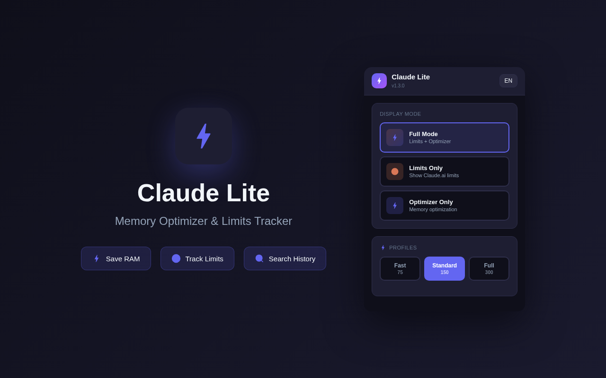
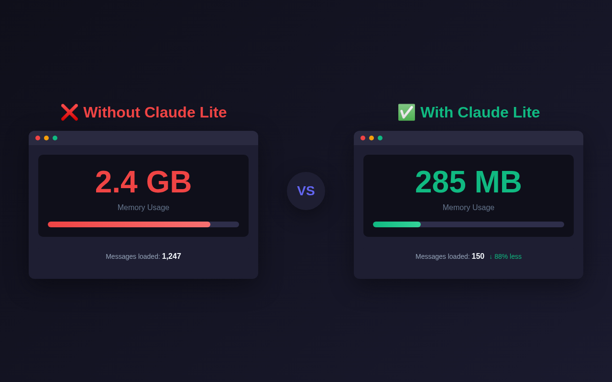
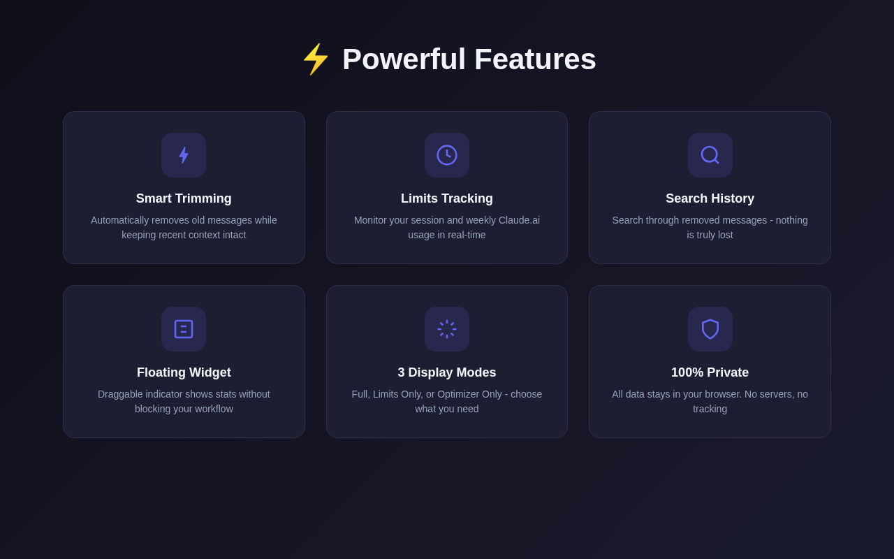
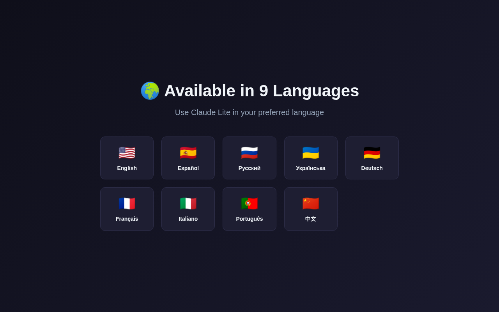

# ⚡ Claude Lite — Memory Optimizer & Limits Tracker

A Chrome extension that fixes lag issues in long Claude.ai conversations by reducing DOM elements and tracking your usage limits.

## 🎯 The Problem

When you have 1000-2000+ messages in a Claude.ai chat, the browser starts lagging badly. The tab becomes unresponsive, sometimes crashes.

**Why?** React renders all messages as DOM elements at once. Claude doesn't lazy-load messages on scroll like Telegram — it keeps everything rendered, causing the JS Heap to grow to 2-4 GB.

## ✨ The Solution

Claude Lite intercepts chat loading and keeps only the last N messages (configurable from 2 to 500). Old messages aren't deleted from the server — they just don't load into the browser.

**Result:** JS Heap drops from several gigabytes to ~200-300 MB. Everything runs smooth again.

## 🚀 Features

### Memory Optimizer
- Smart message trimming (keep 2-500 messages)
- Search through removed messages (stored locally)
- Real-time JS Heap monitoring
- Quick profiles: Fast (75), Standard (150), Full (300)

### Limits Tracker
- Session limit usage (5-hour)
- Weekly limit usage
- Time until reset
- Color-coded progress bars

### Interface
- Floating draggable indicator
- 3 display modes: Full / Limits Only / Optimizer Only
- Dark theme matching Claude's interface
- 9 languages: EN, ES, DE, FR, IT, PT, RU, UK, ZH

## 📦 Installation

### From Chrome Web Store
https://chromewebstore.google.com/detail/claude-lite/jjnpgbknaolhhallboicaeeimhdnkdhd

### Manual Installation (Latest Version)
1. Download or clone this repository
2. Open Chrome → `chrome://extensions/`
3. Enable "Developer mode" (top right)
4. Click "Load unpacked"
5. Select the extension folder

## 🌍 Languages

English, Español, Deutsch, Français, Italiano, Português, Русский, Українська, 中文

## 🔒 Privacy

- No data collection
- No external servers
- Everything works locally in your browser

## 👤 Author

**N33verm0re** — [Telegram](https://t.me/N33verm0re)

## 📄 License

MIT License
